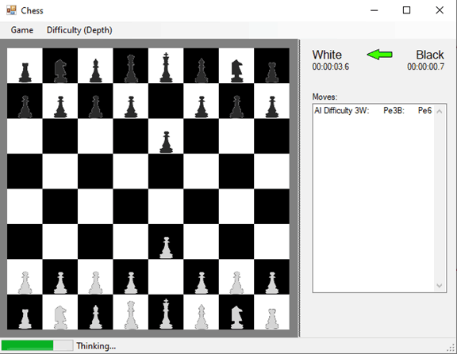
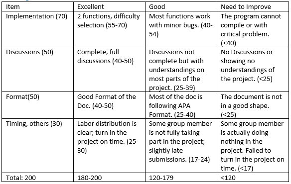

# CSCI280: Artificial Intelligence - Final Project - Chess AI
## Overview
In this project, we will be working on chess AI design, using this example to show how we can apply Minimax and Alpha-Beta pruning to chess game decision making.

Your team are going to work in implementing Min-max function and Alpha-Beta pruning function in AI.cs. All other code are already provided, as well as part of AI.cs.

## Work to be done
- 2 critical functions to help with chess game
- Report (5-8 pages)
   - including an introduction of implemented methods
   - related research/reading and experimental results. 
   - You will be expected to show how the difference in difficulty reflected in your depth settings. 
   - Some labor distributions are also expected to be described.

## Deliverables
- Complete project (.zip) file;
- Group Final Document in APA Format.

## References
https://github.com/sscheele/chess-AI

https://github.com/bdidemus/chess

## Grading Criteria

## Due Date
04/29/2022, Midnight.